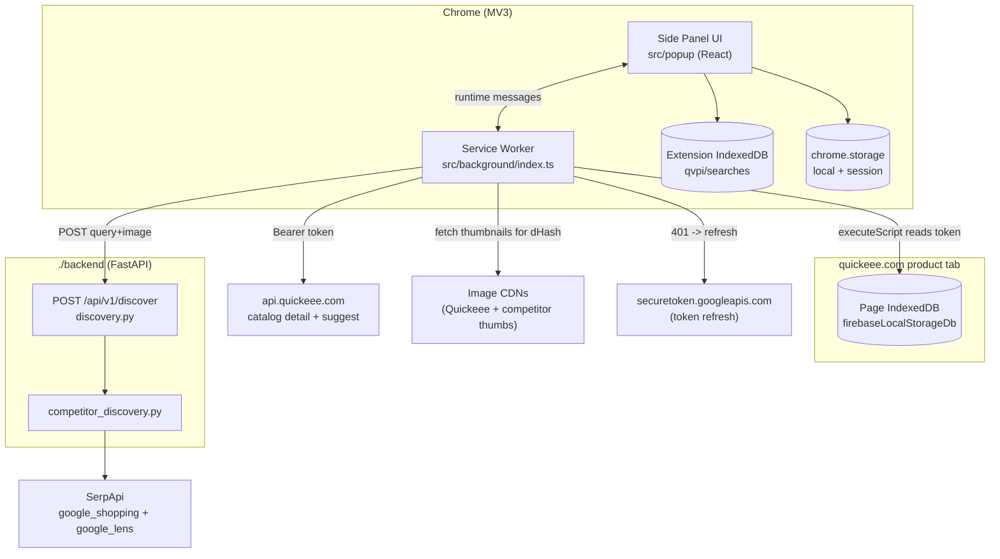

# Quickeee Visual Price Intelligence — Architecture (Index)

> **Audience:** maintainers and new engineers. This is the hub; detailed topics live in [`docs/`](docs/).
>
> **Repository:** `quickeee-visual-extension/` — a Chrome MV3 side-panel extension **plus** a bundled
> FastAPI backend (`./backend`). One repo, two runtimes.
>
> **Key status note:** the backend has TWO API surfaces. The extension uses **only**
> `POST /api/v1/discover`. The larger `/api/v1/search` workflow (orchestrator + Playwright + AI
> vision) is **inherited** from the original `quickeee-visual-agent` project and is **not** called by
> the extension at runtime. The docs flag the active path throughout.

---

## Documentation map

| Doc | Covers |
|-----|--------|
| [docs/folder-structure.md](docs/folder-structure.md) | Annotated tree + per-file reference (purpose / imports / imported-by / functions) |
| [docs/extension.md](docs/extension.md) | Chrome extension: manifest, side panel, service worker, content-script injection, messaging, storage, API comms |
| [docs/backend.md](docs/backend.md) | FastAPI startup, routes, services, models, utilities, SerpApi/discovery, response generation |
| [docs/request-flow.md](docs/request-flow.md) | End-to-end lifecycle sequence + function call chain + dependency graph |
| [docs/data-models.md](docs/data-models.md) | Every TS type + ORM model + schema (with ER diagram) |
| [docs/api.md](docs/api.md) | Every endpoint: method, body, response, examples, errors |
| [docs/engines.md](docs/engines.md) | Search history, coupon engine, matching engine, comparison engine |
| [docs/configuration.md](docs/configuration.md) | Config files, env vars, build commands, deployment + checklist |
| [docs/onboarding.md](docs/onboarding.md) | Step-by-step code walkthrough + debugging guide |
| [docs/roadmap.md](docs/roadmap.md) | Future improvements (caching, scaling, alerts, dashboard…) |

Other docs in the repo: [README.md](README.md), [INSTALL.md](INSTALL.md), [BUILD.md](BUILD.md),
[DEPLOY.md](DEPLOY.md), [TESTING.md](TESTING.md), [PRODUCTION.md](PRODUCTION.md).

---

## 1. Project Overview

### What this project does
From a **Quickeee product page** (`quickeee.com/product/<slug>`), the extension:

1. **Extracts** the real product — brand, title, selling price, image, **and any on-page coupon /
   effective price** — client-side, using the page's own Firebase token + the Quickeee catalog API.
2. **Discovers** competitor listings (Amazon, Flipkart, Myntra, Ajio, Tata CLiQ, brand stores…)
   through a thin local backend that proxies **SerpApi** (Google Shopping + Google Lens). The SerpApi
   key never ships in the extension bundle.
3. **Verifies** each competitor is the *same product* via a client-side text + image scorer
   (model/title/brand/image), accepting only matches ≥ 90 % with a model gate.
4. **Compares** prices across the verified set against the **coupon-aware** Quickeee price
   (lowest/avg/highest, per-row diff, savings, ranking, insights), and exports CSV/JSON/text.
5. **Tracks** price history over time (per-product snapshots) and logs a **global search history**.

### Technologies
React 18 + TypeScript (strict) + Tailwind, built by Vite 5 + `@crxjs/vite-plugin`; MV3 service
worker, `chrome.scripting`/`sidePanel`/`storage`, IndexedDB, OffscreenCanvas (dHash). Backend:
Python 3.12, FastAPI, Uvicorn, Pydantic v2, SQLAlchemy(async)+asyncpg→Postgres (Neon), SerpApi via
httpx. Inherited (unused by ext.): Playwright, Pillow/imagehash, OpenCV, Anthropic/OpenAI SDKs.
Tooling: `uv`, Alembic, Docker.

### High-level architecture
**Client-heavy.** Extraction, verification, comparison, coupon logic, history, and exports are 100 %
in the extension. The backend exists for one reason: hold the SerpApi key and run competitor
discovery. **Trust boundary:** SerpApi key lives only on the backend; the Quickeee token is read from
the page's own IndexedDB and used only against `api.quickeee.com`. **No mock / no fallback products**
in the active path: real data or an explicit error.

### Overall workflow
`Detect page → Extract product (+coupon) → Normalize → Discover (backend→SerpApi) → Verify (client)
→ Price compare (coupon-aware) → Render → Snapshot + Search history → Export`. Full detail in
[docs/request-flow.md](docs/request-flow.md).

### Complete system diagram

---

## Project Rules (read before changing anything)

1. **Never use mock data** in the active path. Real data or an explicit error.
2. **Never replace products with fallback products** — extraction failure surfaces a clear message.
3. **Preserve the existing architecture** — client-heavy; backend only for discovery.
4. **Modify the minimum number of files** for any change; prefer additive edits.
5. **Run `npm run build` after every change** (typecheck + bundle) before considering it done.
6. **Do not rewrite working modules** (don't "fix" the startup `create_all`, the `https://*/*` host,
   or the inherited `/search` services without an explicit, scoped decision).
7. **Keep the SerpApi key server-side only** — never embed it in the extension bundle.
8. **Keep matching model-dominant** — visual similarity alone (10 %) may never approve a match; SKU
   products need identity confirmation.
9. **Don't change the price-engine contract** (`computePriceIntel`/`PriceIntel`) — relied on by the
   table, exports, snapshots and search history.
10. **Coupon is auto-detected only** — no manual coupon input; baseline is
    `comparisonPrice() = effectivePrice ?? price`.
11. **Don't modify search-history logic** for price features — persist new data via `full.product`.
12. **Secrets never get committed** — `.env` is gitignored; rotate any leaked keys.
