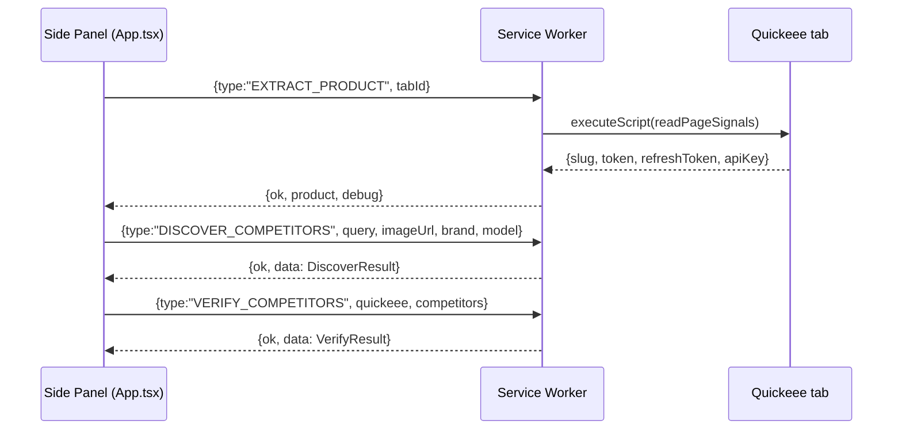

# Chrome Extension Architecture

[← Architecture index](../ARCHITECTURE.md) · Related: [Request Flow](request-flow.md) · [Engines](engines.md) · [Folder Structure](folder-structure.md)

The extension is **client-heavy**: extraction, verification, price comparison, coupon logic,
history, and exports all run in the browser. The backend exists only to hold the SerpApi key and
run competitor discovery.

## manifest.json (emitted from `src/manifest.ts`)
- MV3, `minimum_chrome_version: 114`.
- **No `default_popup`** — the toolbar action opens a **side panel** (`side_panel.default_path`).
- **Permissions:** `activeTab`, `scripting` (inject the page reader), `tabs` (follow active tab),
  `storage` (snapshots + session cache), `sidePanel`.
- **Host permissions:** `*.quickeee.com` + `api.quickeee.com` (catalog API), `http://localhost/*` +
  `http://127.0.0.1/*` (discovery backend, any port), `https://*/*` (fetch competitor/Quickeee
  images for dHash; reach `securetoken.googleapis.com`).
- **No content script is declared** — the page reader is injected on demand via `chrome.scripting`.

## Popup vs Side panel
There is no popup. `index.html` → `src/popup/main.tsx` → `<App/>` renders inside the **docked side
panel**, which stays open while browsing. The folder is named `popup/` for historical reasons.
The background sets `chrome.sidePanel.setPanelBehavior({ openPanelOnActionClick: true })`.

## Background / service worker (`src/background/index.ts`)
Three message handlers, each returning `true` for async `sendResponse`:
`EXTRACT_PRODUCT`, `DISCOVER_COMPETITORS`, `VERIFY_COMPETITORS`. Only the worker has host
permissions + `chrome.scripting`, so it is the bridge to every network.

## Content scripts
None declared. Instead `chrome.scripting.executeScript({func: readPageSignals})` runs a
**self-contained** function in the page's ISOLATED world (same-origin, so it can read the SPA's
IndexedDB to obtain the Firebase token). It must not reference outer scope — it is serialized and
executed inside the tab.

## Messaging

Payload shapes are typed in `src/lib/messages.ts`. `runIdRef` in `App.tsx` discards responses from
superseded runs (navigating away mid-run can't paint stale data).

## Storage
- **`chrome.storage.session`** — `qvpi.last.<slug>`: last `{product, verifyData, matchQuery}` for
  instant restore on reopen (cleared at session end).
- **`chrome.storage.local`** — `qvpi.history.<slug>`: per-product price **snapshots** (cap 400).
- **Extension IndexedDB** (`qvpi/searches`) — global **search history** (append-only, thousands).
- The **page's** IndexedDB (`firebaseLocalStorageDb`) is *read* (token) but never written.

## API communication
- **Quickeee catalog API** (`api.quickeee.com`): `GET /catalog/products/{slug}/detail` and
  `GET /search/suggest?...` with `Authorization: Bearer <token>`. Called directly from the worker
  (host permission exempts CORS). On `401`, the worker refreshes via `securetoken.googleapis.com`
  and retries once.
- **Discovery backend**: `POST {BACKEND_BASE}/api/v1/discover` with `{query, image_url, brand, model}`.

## Feature modules (where each lives)
- **Search history** → [`searchHistory.ts`](engines.md#a-global-search-history) (global IndexedDB) +
  `history.ts` (per-product). See [Engines](engines.md).
- **Coupon engine** → `detectCoupon` in `background/index.ts`; surfaced by `ProductCard` /
  `PriceComparison`; baseline via `comparisonPrice()`. See [Engines](engines.md#coupon-engine).
- **Comparison engine** → `lib/priceIntel.ts`. See [Engines](engines.md#matching-engine).
- **Export module** → `lib/exporters.ts` (comparison) + `lib/historyExport.ts` (history) +
  `searchHistoryToCsv` (search history). See [API & Data shapes](data-models.md).
