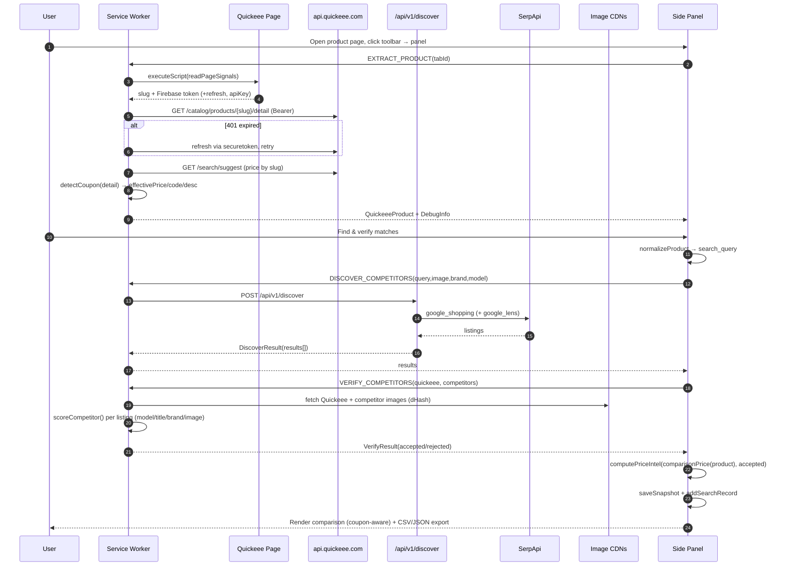
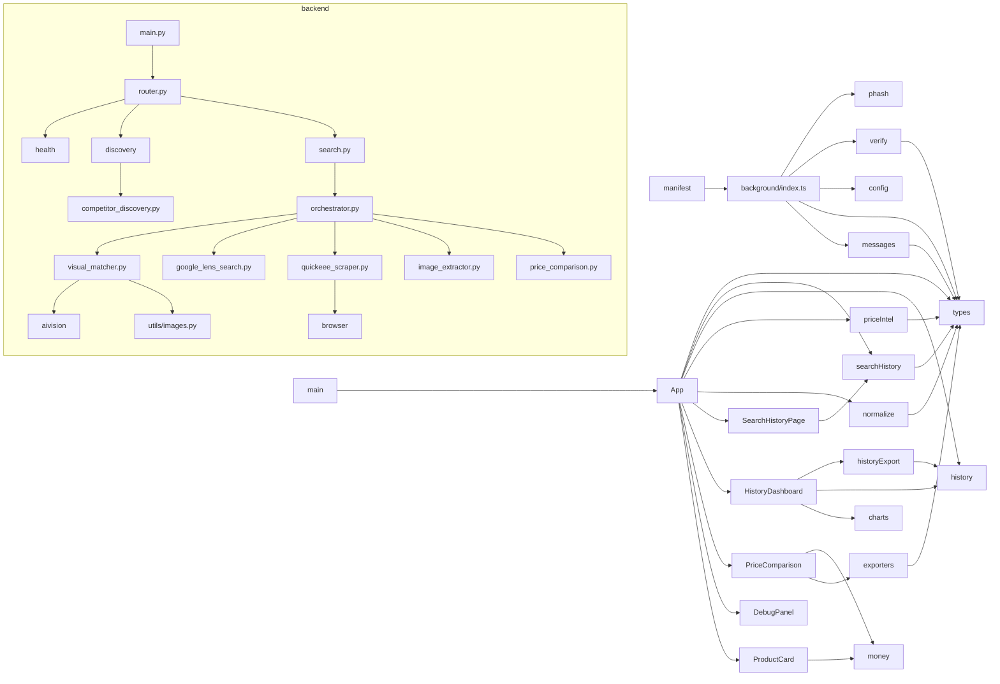

# Complete Request Flow & Dependency Map

[← Architecture index](../ARCHITECTURE.md) · Related: [Extension](extension.md) · [Backend](backend.md) · [Engines](engines.md)

> Note: **image & title verification happen client-side** (`verify.ts` + `phash.ts`), not on the
> backend. The active path never touches the inherited Quickeee scraper / AI-vision backend.

## Lifecycle (sequence)

## Function call chain (in order)
`loadActiveTab` → `extract` → (`readPageSignals`, `getSignals`, `getJson`, `refreshIdToken`,
`priceFromSuggest`, `detectCoupon`) → `extractProduct` → `normalizeProduct` → `findMatches` →
`discoverCompetitors` → (`competitor_discovery.discover`) → `verifyCompetitors` (`hashImageUrl`,
`imageScore`, `scoreCompetitor`, `mapLimit`) → `comparisonPrice` → `computePriceIntel`
(`confidenceOf`, `buildInsights`) → `saveSnapshot` + `addSearchRecord` → `PriceComparison` render →
`toCsv`/`toJson`/`toText`.

## File dependency graph

## Imports / Exports / Called By / Calls (selected)

| File | Imports | Exports | Called By | Calls |
|------|---------|---------|-----------|-------|
| `background/index.ts` | messages, types, config, verify, phash | (none; SW) | manifest | Quickeee API, securetoken, `/discover`, image CDNs |
| `App.tsx` | components, normalize, priceIntel, types, history, searchHistory, messages | `App` | `main.tsx` | `chrome.runtime.sendMessage`, `chrome.tabs`, storage |
| `priceIntel.ts` | types | `computePriceIntel`, `confidenceOf` | `App.tsx` | — |
| `verify.ts` | types | `scoreCompetitor`, `ACCEPT_THRESHOLD`, `MODEL_GATE` | `background` | — |
| `phash.ts` | — | `hashImageUrl`, `imageScore`, `Hash` | `background` | `fetch`, OffscreenCanvas |
| `exporters.ts` | types | `toJson/toCsv/toText` | `PriceComparison` | — |
| `history.ts` | — | storage + analytics fns | `App`, `HistoryDashboard`, `historyExport` | `chrome.storage.local` |
| `searchHistory.ts` | types | record CRUD + csv | `App`, `SearchHistoryPage` | IndexedDB |
| `discovery.py` | settings, competitor_discovery | router | `router.py` | `discover` |
| `competitor_discovery.py` | settings, logging, httpx | `discover` | `discovery.py` | SerpApi |
| `orchestrator.py` | models, services, types | `run_workflow`, `load_run`, `assemble_result` | `search.py` | scraper/search/matcher/comparison |
